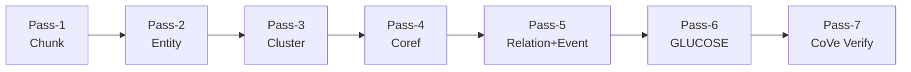

# LoreGraph

> Knowledge graphs from closed-world fiction, with evidence on every edge.

[](LICENSE)
[](pyproject.toml)
[](#roadmap)

**LoreGraph** extracts entities, relations, events, and implicit story-level facts from a single closed-world fictional text (novel, screenplay, script) into a queryable knowledge graph — with every claim traceable to a literal span in the original text.

## Why LoreGraph

Mainstream GraphRAG pipelines target the open web, where contradictions can be resolved by adding more sources. Fiction is **closed-world**: the answer to "what does this character believe?" must come from the text alone, every inference must cite a span, and the graph must support multi-character viewpoints, foreshadowing, and counterfactual continuations.

LoreGraph implements a **7-Pass extraction pipeline** synthesizing best practices from BookNLP, GLUCOSE, Microsoft GraphRAG, HippoRAG 2, and Zep, with a strict evidence-span match policy as a hallucination guardrail.

## The 7-Pass Pipeline



| Pass | Purpose | Key technique |
|---|---|---|
| 1 · Chunk | Chapter-aware slicing | 600–1200 token chunks, 20% overlap, `atom_id = ch{N}_p{seq}` |
| 2 · Entity | Mention extraction | LLM + Pydantic schema, **gleaning ≤ 2 rounds** |
| 3 · Cluster | Book-wide canonical IDs | BookNLP-style alias merge: embedding + edit-distance gated LLM judge |
| 4 · Coref | Local coreference | LingMess / LLM coref, all mentions point at canonical_id |
| 5 · Relation+Event | Edges + events | 5 relation types; **realis-trigger** event definition (LitBank) |
| 6 · GLUCOSE | Implicit info | 10-dim (cause/emotion/loc/poss/attr × before/after) + `inference_depth` |
| 7 · CoVe | Verification | Chain-of-Verification; **evidence_span literal match ≥ 95%** required |

## Quick start

> **Prerequisites**: Python 3.11+, Docker, an Anthropic API key.

```bash
git clone https://github.com/YunyueLi/LoreGraph.git
cd loregraph
cp .env.example .env                     # add your ANTHROPIC_API_KEY
docker compose up -d                     # postgres + pgvector
uv pip install -e ".[dev]"
uv run alembic upgrade head              # initialise schema
uv run loregraph ingest examples/alice/input.txt --title "Alice"
uv run loregraph extract --book-id 1
uv run loregraph view --book-id 1         # opens browser to graph UI
```

Many of these commands print `not implemented yet` in v0.1.0.dev0 — see [Roadmap](#roadmap).

## Architecture

See [`docs/architecture.md`](docs/architecture.md) for the full design rationale and the synthesis of academic prior work that shaped each choice.

Layer cake:

```
┌──────────────────────────────────────────┐
│  Web UI   FastAPI + React + Cytoscape    │
├──────────────────────────────────────────┤
│  CLI      Typer                          │
├──────────────────────────────────────────┤
│  Pipeline 7-Pass orchestrator            │
├──────────────────────────────────────────┤
│  LLM      Anthropic SDK + prompt cache   │
├──────────────────────────────────────────┤
│  Storage  SQLAlchemy 2.0 + PG+pgvector   │
└──────────────────────────────────────────┘
```

## Deploy your own demo

Three free-tier services + your Anthropic key get you a public,
shareable graph explorer:

```
Cloudflare Pages (React SPA)
       │
       ▼  via VITE_API_BASE
Render web service (FastAPI + LoreGraph)
       │
       ▼
Neon serverless Postgres + pgvector
```

Step-by-step in [`docs/deployment.md`](docs/deployment.md). ~15 minutes
end-to-end if you already have Anthropic billing set up.

## Roadmap

| Version | Phase | Scope |
|---|---|---|
| **v0.1** _(in progress)_ | Phase 0 + 1 | The 7-Pass extraction pipeline, CLI, Web UI |
| v0.2 | Phase 2 | Leiden community detection · HippoRAG 2 PPR retrieval · LightRAG dual-level keyword index |
| v0.3 | Phase 3 | Internal reflection · foreshadowing detection · contradiction sweep |
| v0.4 | Phase 4 | Generative Agents · SymbolicToM belief graphs · MCTS counterfactual continuation |

## Academic references

LoreGraph synthesizes design choices from a body of prior work. BibTeX in [`docs/references.bib`](docs/references.bib).

- Bamman, Lewke, Mansoor. *An Annotated Dataset of Coreference in English Literature*. LREC 2020. (LitBank)
- Sims, Park, Bamman. *Literary Event Detection*. ACL 2019.
- Mostafazadeh et al. *GLUCOSE: GeneraLized and COntextualized Story Explanations*. EMNLP 2020 (Best Paper).
- Edge et al. *From Local to Global: A GraphRAG Approach to Query-Focused Summarization*. arXiv:2404.16130, 2024.
- Gutiérrez et al. *HippoRAG 2: From RAG to Memory*. arXiv:2502.14802, 2025.
- Rasmussen et al. *Zep: A Temporal Knowledge Graph Architecture for Agent Memory*. arXiv:2501.13956, 2025.
- Dhuliawala et al. *Chain-of-Verification Reduces Hallucination in LLMs*. arXiv:2309.11495, 2023.
- Park et al. *Generative Agents: Interactive Simulacra of Human Behavior*. UIST 2023.
- Sclar et al. *Minding Language Models' (Lack of) Theory of Mind*. arXiv:2306.00924, 2023. (SymbolicToM)

## Contributing

Issues and PRs welcome. See [`CLAUDE.md`](CLAUDE.md) for repo conventions and [`docs/architecture.md`](docs/architecture.md) for design rationale. All bug reports should include a minimal reproducible passage from a public-domain text.

## License

Apache 2.0 — see [`LICENSE`](LICENSE).
