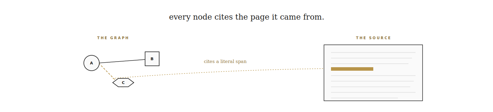
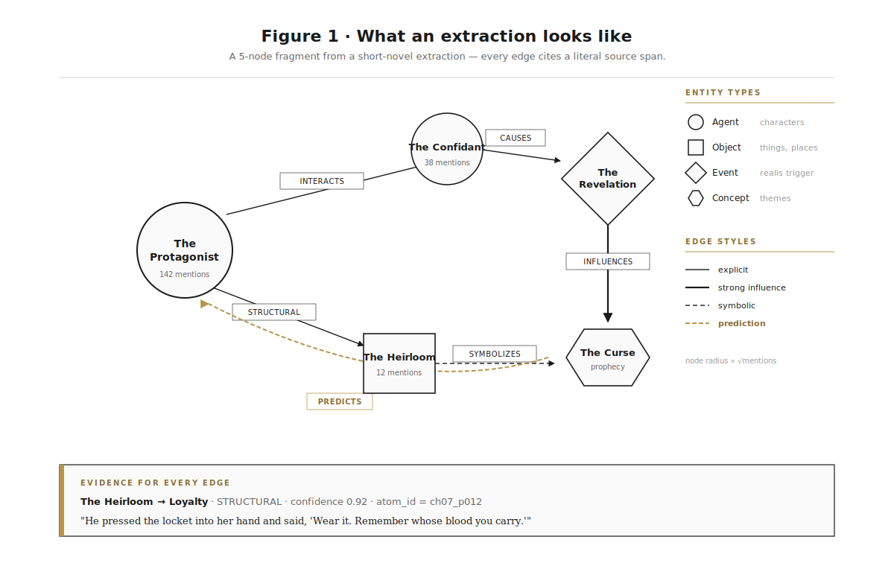
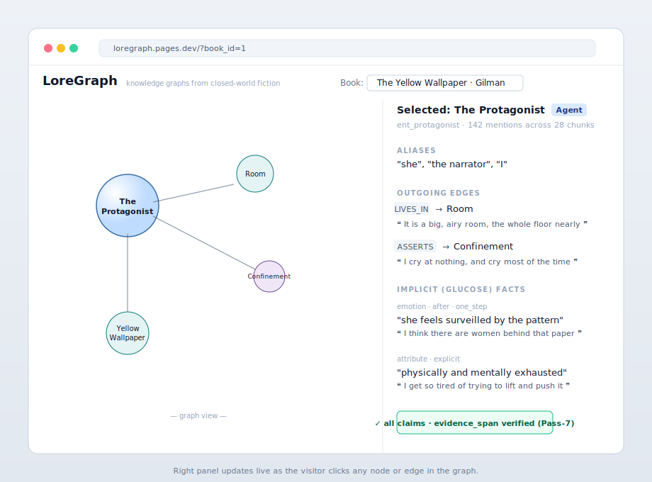
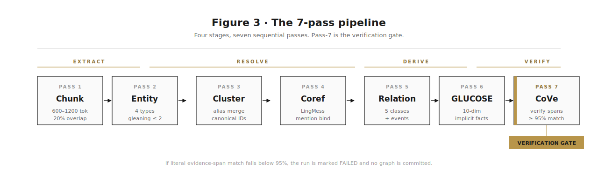
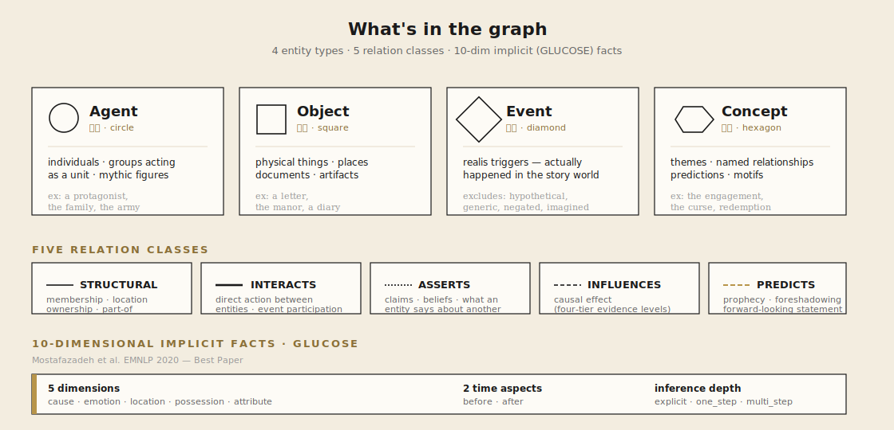
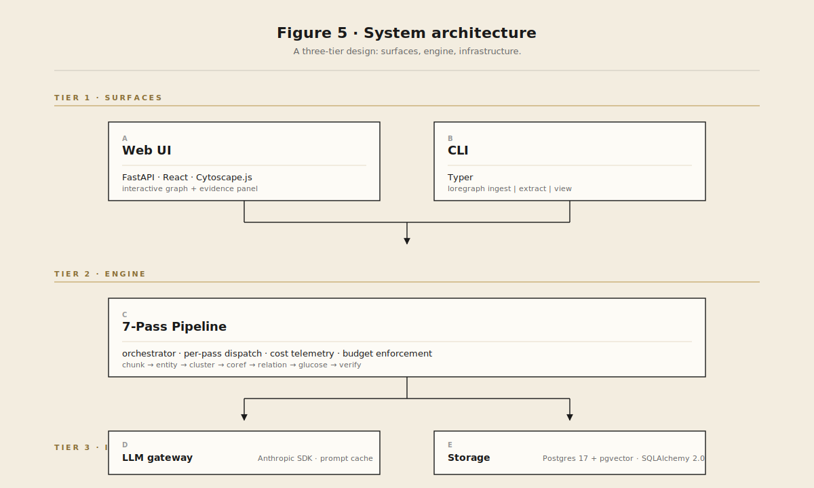
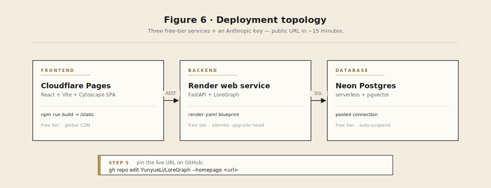

<div align="center">



<br>

# LoreGraph

***让图谱替自己作证。***

一条 7-Pass LLM 流水线，
把一部小说、剧本或电影分镜本，
变成每条主张都引用原文字面片段的可查询知识图谱。

<br>

[](https://github.com/YunyueLi/LoreGraph)
[](https://github.com/YunyueLi/LoreGraph/stargazers)
[](LICENSE)
[](#-路线图)

[](#-7-pass-流水线)
[](#-路线图)
[](pyproject.toml)

<br>

[English](README.md)  ·  **简体中文**

[**快速开始**](#-快速开始) · [**能抽取出什么**](#-能抽取出什么) · [**流水线**](#-7-pass-流水线) · [**部署**](#-部署你自己的-demo) · [**路线图**](#-路线图)

<br>

> *"书不是用来被相信的，*
> *书是用来被审视的。"*
>
> **Umberto Eco**　·　*《玫瑰之名》*

</div>

---

## ✨ 为什么需要它

主流的 **GraphRAG** 流水线为开放网络设计——遇到矛盾就加更多来源。**文学不一样。**

当你问"**这个角色相信什么**"，答案必须**只来自文本本身**。每一条推断必须**引用原文**。图谱要能处理**多角色视角**、**伏笔回收**、**反事实续写**。

**LoreGraph** 把一部小说、剧本或电影分镜本，自动抽取成一个可查询的知识图谱——**每一条主张都锚定在原文的字面片段上**——并通过命令行和交互式 Web UI 暴露出来。

它综合了四条线的最佳实践：

|  |  |
|---|---|
| **叙事 NLP** | BookNLP · LitBank · GLUCOSE · 文学事件检测 |
| **工业级 KG-RAG** | Microsoft GraphRAG · HippoRAG 2 · LightRAG · Zep |
| **LLM 抽取** | GPT-NER · Chain-of-Verification · BOOKCOREF |
| **Agent 模拟** *(v0.4)* | Generative Agents · SymbolicToM · MCTS 叙事 |

——并以严格的 **证据片段字面匹配率 ≥ 95%** 作为防幻觉硬门控。

---

## 🚀 快速开始

```bash
git clone https://github.com/YunyueLi/LoreGraph.git
cd LoreGraph
cp .env.example .env                                  # 选 provider 并填 key（见下）
docker compose up -d                                  # postgres + pgvector
pip install -e ".[dev]" && alembic upgrade head

loregraph ingest examples/yellow_wallpaper/input.txt --title "Yellow Wallpaper"
loregraph extract --book-id 1
loregraph view --book-id 1                            # 浏览器打开 http://localhost:8000
```

> 一篇短篇小说（约 6000 词）跑完 7-Pass：Anthropic 含 prompt cache 折扣约 **$0.20 – 1.00**；DeepSeek / 通义 / Gemini Flash 通常 **便宜 3–10 倍**；本地 Ollama / vLLM **完全免费**（代价是模型小、推理慢）。

---

## 🔌 自带 LLM · 多 provider 支持

LoreGraph 兼容任何**说 Anthropic native 或 OpenAI-compatible chat-completions** 的 LLM。换 provider 只需要改一个环境变量：

```bash
# Anthropic Claude（默认 · 保留 prompt caching）
LOREGRAPH_LLM_PROVIDER=anthropic
ANTHROPIC_API_KEY=sk-ant-...

# DeepSeek
LOREGRAPH_LLM_PROVIDER=deepseek
DEEPSEEK_API_KEY=sk-...

# 本地 Ollama，免 key
LOREGRAPH_LLM_PROVIDER=ollama
LOREGRAPH_LLM_MODEL=llama3.2          # 可选 override

# 任何 OpenAI-compatible 端点
LOREGRAPH_LLM_PROVIDER=openai_compatible
LOREGRAPH_LLM_BASE_URL=https://your.endpoint/v1
LOREGRAPH_LLM_API_KEY=...
LOREGRAPH_LLM_MODEL=your-model
```

内置 provider preset（每个都带默认模型）：

| 类别 | Provider |
|---|---|
| **国际头部** | `anthropic` · `openai` · `gemini` · `grok` |
| **国内** | `deepseek` · `kimi`（月之暗面）· `zhipu`（智谱 GLM）· `qwen`（通义千问 DashScope）|
| **开源模型托管** | `groq` · `together` · `fireworks` · `mistral` |
| **本地** | `ollama` · `vllm` |
| **自定义** | `openai_compatible` |

API key 解析链：`LOREGRAPH_LLM_API_KEY`（通用）→ provider 各自的 env（`OPENAI_API_KEY` / `DEEPSEEK_API_KEY` / `MOONSHOT_API_KEY` / …）→ 无。Anthropic 保留原生 prompt caching；OpenAI auto-cache 和 DeepSeek context cache 在 provider 暴露 `cached_tokens` 时自动累积。

---

## 📖 能抽取出什么

`loregraph extract` 跑完后，数据库里就有完整的图谱——**每一条都带原文字面引用**：

<div align="center">
  
</div>

在 Web UI 里点任何节点或边，能看到完整的来源链：

<div align="center">
  
</div>

---

## 🔬 7-Pass 流水线

<div align="center">
  
</div>

| Pass | 目标 | 关键技术 |
|---|---|---|
| **1** 切片 | 章节感知的文本切分 | 600–1200 token，20% 重叠，`atom_id = ch{N}_p{seq}` |
| **2** 实体 | 4 类提及抽取 | LLM + Pydantic schema，**gleaning ≤ 2 轮** |
| **3** 聚合 | 全书角色归一 | BookNLP 风格别名合并：廉价字符串 gating + LLM 判定 |
| **4** 共指 | 提及 → canonical 绑定 | LingMess / LLM coref；代词级共指 v0.2 落地 |
| **5** 关系+事件 | 5 类关系边 | 事件按 LitBank **realis-trigger** 严格定义；端点强制约束 |
| **6** GLUCOSE | 10 维隐式信息 | `cause / emotion / location / possession / attribute` × `before / after` |
| **7** CoVe | 验证闸门 | Chain-of-Verification；**字面匹配率 ≥ 95%** 才能过关 |

---

## 🧬 图谱里有什么

<div align="center">
  
</div>

---

## 🏗️ 架构

<div align="center">
  
</div>

完整设计原由 + 论文逐项映射 + WMG → LoreGraph 血缘：[**`docs/architecture.md`**](docs/architecture.md)。

---

## 🚢 部署你自己的 demo

<div align="center">
  
</div>

> **国内访问提示**：Cloudflare 在国内有时延和稳定性问题，必要时可换成 Vercel / Netlify；Render 免费层 15 分钟空闲后会休眠，首次访问需 ~30s 唤醒。

逐步指南（含公版小说预录数据）：[**`docs/deployment.md`**](docs/deployment.md)。

---

## 🗺️ 路线图

| 版本 | 重点 | 状态 |
|---|---|---|
| **v0.1** | 7-Pass 抽取 · CLI · Web UI · 部署配置 | ✅ 已发布 |
| **v0.2** | Leiden 社区检测 · HippoRAG 2 PPR 检索 · LightRAG 双层关键词索引 | 🚧 计划中 |
| **v0.3** | 内省精炼 · 伏笔检测 · 跨章矛盾扫描 | 📋 待开 |
| **v0.4** | Generative Agents + SymbolicToM 信念图 + MCTS 反事实续写 | 📋 待开 |

---

## 📜 学术基础

LoreGraph 站在四条线的工作之上。完整 BibTeX 在 [**`docs/references.bib`**](docs/references.bib)。

<details>
<summary><strong>叙事 NLP</strong> — BookNLP / LitBank / GLUCOSE / 文学事件检测</summary>

<br>

- Bamman, Lewke, Mansoor.《英文文学共指标注数据集》(LitBank)，LREC 2020
- Sims, Park, Bamman.《文学事件检测》(Literary Event Detection)，ACL 2019
- Mostafazadeh 等.《GLUCOSE：泛化与情境化的故事解释》，EMNLP 2020 (**Best Paper**)
- Elson, Dames, McKeown.《从文学作品中抽取社交网络》，ACL 2010
- Sims & Bamman.《文学社交网络中的信息传播测度》，EMNLP 2020

</details>

<details>
<summary><strong>工业级 KG-RAG</strong> — GraphRAG / HippoRAG 2 / LightRAG / Zep</summary>

<br>

- Edge 等.《GraphRAG：从局部到全局的查询聚焦摘要》，arXiv:2404.16130，2024（**Microsoft GraphRAG**）
- Gutiérrez 等.《HippoRAG 2:从 RAG 到记忆》，arXiv:2502.14802，2025
- Guo 等.《LightRAG：简洁快速的检索增强生成》，arXiv:2410.05779，2024
- Rasmussen 等.《Zep：用于 Agent 记忆的时序知识图谱架构》，arXiv:2501.13956，2025

</details>

<details>
<summary><strong>LLM 抽取与验证</strong> — GPT-NER / CoVe / BOOKCOREF</summary>

<br>

- Wang 等.《GPT-NER：用大模型做命名实体识别》，arXiv:2304.10428，2023
- Dhuliawala 等.《Chain-of-Verification 降低大模型幻觉》，arXiv:2309.11495，2023
- Cabot & Navigli.《REBEL：端到端语言生成式关系抽取》，Findings of EMNLP 2021
- Liu 等.《Lost in the Middle：大模型如何使用长上下文》，arXiv:2307.03172，2023

</details>

<details>
<summary><strong>Agent 模拟</strong> — Generative Agents / SymbolicToM / FANToM / MCTS 叙事（v0.4 方向）</summary>

<br>

- Park 等.《Generative Agents：人类行为的交互式仿真》，UIST 2023
- Sclar 等.《审视语言模型的心智理论（之缺失）》(SymbolicToM)，arXiv:2306.00924，2023
- Kim 等.《FANToM：交互中的机器心智理论压力测试》，EMNLP 2023
- Gandhi 等.《BigToM》，arXiv:2306.15448，2023
- *Narrative Studio*：用 MCTS 做剧情树规划，arXiv:2504.02426，2025

</details>

如果 LoreGraph 对你的工作有帮助，请同时引用上述基础工作和本项目：

```bibtex
@software{li2026loregraph,
  author = {Li, Yunyue},
  title  = {LoreGraph: Knowledge graphs from closed-world fiction},
  year   = {2026},
  url    = {https://github.com/YunyueLi/LoreGraph}
}
```

---

## 🤝 贡献

欢迎 Issue 与 PR。起步路线：

- 仓库约定：[`CLAUDE.md`](CLAUDE.md)
- 设计原由：[`docs/architecture.md`](docs/architecture.md)
- 7-Pass 规格：[`docs/7-pass-pipeline.md`](docs/7-pass-pipeline.md)

> **重要** —— 所有 bug 报告请使用 **公版文本**（Project Gutenberg / 国家图书馆 / 其他公有领域来源）的最小可复现片段。**不要在 Issue 或测试 fixture 里粘贴版权文本。**

---

## 📄 许可证

Apache 2.0，详见 [`LICENSE`](LICENSE)。

<br>

<div align="center">

<sub>由 <a href="https://github.com/YunyueLi">@YunyueLi</a> 用心打磨 · <em>让图谱替自己作证。</em></sub>

</div>
