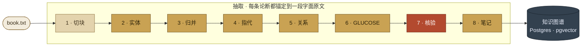
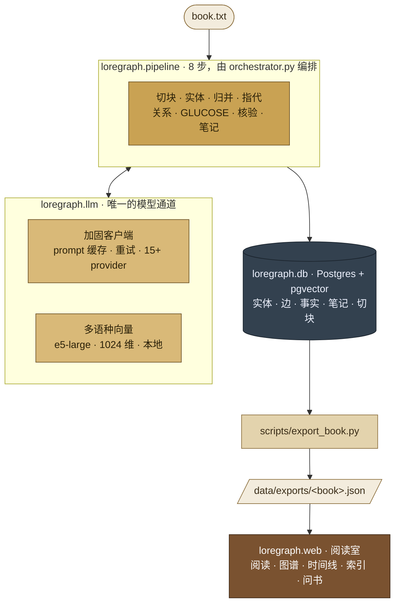

<div align="center">

# LoreGraph

### *每个节点都注明它出自哪一页的知识图谱*

LoreGraph 把一部小说、剧本、电影脚本或歌剧 libretto 变成**可查询的知识图谱**——
人物、物件、事件、概念，它们之间的有类型关系，以及每条关系隐含的事实——
而且**每一条论断都锚定到源文本的一段字面原文。**

没有凭空捏造的边。不用"相信我"。点任意一条关系，直接跳到它出自的那句原文。

`Apache-2.0`  ·  `Python 3.11+`  ·  `8 步流水线`  ·  `Claude Opus 4.8`  ·  `多语种`  ·  `Alpha`

[English](README.md)  ·  **简体中文**

[为什么](#为什么是-loregraph) · [能得到什么](#你会得到什么) · [流水线](#八步流水线) · [快速开始](#快速开始) · [架构](#架构) · [语料](#语料) · [路线图](#状态与路线图)

</div>

---



> **1** 是确定性的 · **2–6、8** 是 LLM 步 · **7** 是 ≥95% 字面命中的核验门槛。

---

## 为什么是 LoreGraph

大多数"从文本抽知识图谱"的工具抽完三元组就让你照单全收。对**虚构作品**而言这是致命的：
一个悄悄编造关系的图谱比没有图谱更糟。LoreGraph 建立在一条不可妥协的铁律上：

> **每条抽取的论断都带一个 `evidence_span`——源文本的字面子串——并由一道
> chain-of-verification 校验丢弃任何字面命中率 < 95% 的论断。**

它还是**闭世界**的：模型只能用眼前的文本。系统明确告诉它，忘掉你知道的现实中的
"伊丽莎白·班纳特"或"孫悟空"，只报告*这本书*说了什么。

并且**全程多语种**：85 部参考语料横跨英文、中文、Русский、Deutsch、Français、
Italiano、日本語、Ελληνικά 等。源文本保持原文字形；实体归并跑在多语种向量模型上，
所以**"林黛玉"/"颦儿"** 或 **"the Dark Lord"/"Voldemort"** 即使零字面重叠也能并成一个节点。

---

## 你会得到什么

每本书都有一个网页阅读室，五个相互联动的视图，全部由同一张有据可查的图谱驱动：

| 视图 | 展示什么 |
|---|---|
| 📖 **阅读** | 原文，每个实体提及高亮且可点击。 |
| 🕸 **图谱** | 力导向的 人物/物件/事件/概念 网络。悬停任意边 → 源文那句话。 |
| ⏳ **时间线** | 按阅读顺序排列的故事事件（每条事实都带故事时间坐标）。 |
| 📇 **索引** | 可搜索的实体目录 + 每个实体的档案卡。 |
| 💬 **问书** | 基于图谱的问答——每个回答都附证据出处。 |

每个实体都有结构化的 **Hybrid Note**：`[CONTEXT] [FACTS] [INFERENCES] [BEHAVIOR_PATTERN]
[GAPS] [EVIDENCE]`——事实与推断严格分开，每条推断都标注把握度。

---

## 八步流水线

一本书流经八步（见上图）。切块是确定性的，其余是 LLM 调用，全部走同一个加固过的客户端。

| # | 步骤 | 做什么 |
|---|---|---|
| 1 | **切块** | 确定性、章节感知的切分器（认英文 *和* 中文"第N回"）。给每块标全书故事时间坐标。 |
| 2 | **实体** | 抽取有类型的提及（Agent/Object/Event/Concept）+ 字面证据。用 *gleaning*（"还漏了谁？"重试）提召回。 |
| 3 | **归并** | 生产级实体归并：词法 **+ embedding-kNN 召回** → 批量 LLM 判同 → 连通分量 → 防"黑洞"误合并的 sanity 检查。跨字形并别名。 |
| 4 | **指代** | 把每个提及链到它的规范实体。 |
| 5 | **关系** | 五类关系（STRUCTURAL/INTERACTS/ASSERTS/INFLUENCES/PREDICTS）+ 谓词、强度、情感，每条带证据。 |
| 6 | **GLUCOSE** | 关于实体的隐式常识事实（因果/情绪/位置/所属/属性）。 |
| 7 | **核验** | chain-of-verification：丢弃证据非字面命中的论断。≥95% 硬门槛。 |
| 8 | **笔记** | 合成每个实体的 Hybrid Note，赋予子类型与重要度分级。 |

**生产级工程**（对标 Splink / ComEM / GraphRAG 与 Anthropic、OpenRouter 官方文档）：

- **Prompt 缓存** 命中稳定系统提示——实测**命中率 99.9%**（输入便宜约 10×）。
- **有界并发**的逐块 LLM 调用（比串行快约 10×），带重试 + 退避 + 抖动。
- **逐步提交 + 幂等重跑**——某步失败用 `--from N` 续跑，绝不重复写入。
- **provider 无关**客户端：默认 OpenRouter 上的 Claude Opus 4.8，可切 15+ 后端。

---

## 快速开始

```bash
uv sync                                                   # 安装

createdb loregraph && psql loregraph -c "CREATE EXTENSION IF NOT EXISTS vector;"
uv run alembic upgrade head                               # Postgres + pgvector

cp .env.example .env                                      # 配置 provider + API key
                                                          # 默认 openrouter + anthropic/claude-opus-4.8

uv run loregraph ingest book.txt --title "西游记" --author "吴承恩" --language zh
uv run loregraph extract --book-id 1                      # 跑 1–8 步
uv run loregraph status --book-id 1                       # 逐步进度、token、成本
uv run loregraph view                                     # 启动网页阅读室
```

---

## 架构



- **`src/loregraph/pipeline/`** —— 各步骤，一步一个模块，由 `orchestrator.py` 编排。
- **`src/loregraph/llm/`** —— 唯一的 LLM 客户端（缓存、重试、多 provider）+ 本地多语种向量器。
- **`src/loregraph/db/`** —— SQLAlchemy 2.0 模型 + 异步仓储层。迁移在 `migrations/`。
- **`src/loregraph/web/`** —— FastAPI 接口 + 落地页 / 阅读室前端。
- 完整设计见 [`docs/architecture.md`](docs/architecture.md)。

---

## 语料

LoreGraph 自带 **85 部经典作品** 参考集——小说、戏剧、歌剧、早期电影，横跨 11 种语言。

**严格尊重版权。** 源文本**绝不提交**——`data/books/` 已加入 git 忽略。只发布*派生*
元数据（图谱、合理使用范围内的短证据片段、档案笔记）；只有公版作品才嵌入完整阅读原文。
版权作品仅在本地处理，只对外呈现图谱与分析。

---

## 配置

| 变量 | 默认 | 说明 |
|---|---|---|
| `LOREGRAPH_LLM_PROVIDER` | `openrouter` | `anthropic`、`openai`、`deepseek`、`ollama`… (15+) |
| `LOREGRAPH_LLM_MODEL` | 各 provider 预设 | OpenRouter 预设 = `anthropic/claude-opus-4.8` |
| `LOREGRAPH_EMBED_MODEL` | `intfloat/multilingual-e5-large` | 本地、1024 维、多语种 |
| `DATABASE_URL` | 本地 Postgres | 必须用异步 `asyncpg` 驱动 |
| `LOREGRAPH_COST_CEILING_USD` | `100` | 单本硬上限 |

---

## 状态与路线图

**Alpha。** 抽取引擎已生产级加固，参考语料正在处理中。

- [x] 八步、有据可查的抽取流水线
- [x] 生产级实体归并（embedding 召回 + 批量判同 + 防黑洞守卫）
- [x] 多语种（源文本 + 向量 + 界面）、prompt 缓存、并发、可续跑
- [x] 网页阅读室：阅读 · 图谱 · 时间线 · 索引 · 问书
- [ ] **叙事时间轴** —— 看关系*随剧情演变*（"读到第N章为止"的滑块）
- [ ] **派系/社区层** —— 自动识别的家族、阵营、支线
- [ ] **跨书超级图谱** —— 原型与影响链，连起全部 85 部
- [ ] **基于证据的角色对话** —— "和角色聊天"，回答带出处、防剧透
- [ ] **质量评分** —— 超越字面命中的逐本置信度/覆盖度指标

---

## 开发

```bash
uv run ruff format && uv run ruff check     # 格式化 + lint
uv run mypy src                             # 类型检查
uv run pytest -m unit                       # 快速单测
uv run pytest -m integration                # Postgres testcontainer + mocked LLM
```

约定见 [`CLAUDE.md`](CLAUDE.md)；逐步规格见 [`docs/7-pass-pipeline.md`](docs/7-pass-pipeline.md)。

## 许可

[Apache 2.0](LICENSE)。源文本不属于本仓库；参考语料在 ingest 时从公开来源
（Project Gutenberg、Wikisource 等）在本地组装。
