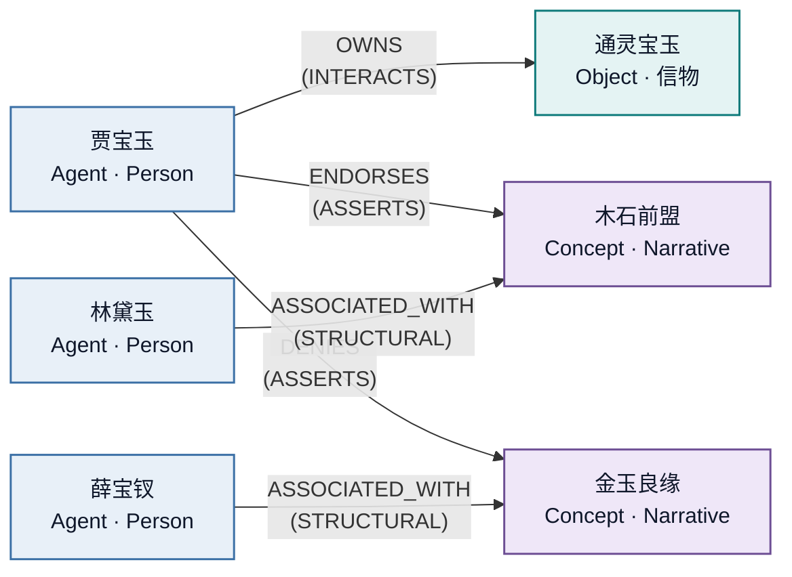

<div align="center">

<br>

# 🕸️ LoreGraph

### 从封闭世界的文学作品中抽取知识图谱<br>每一个节点、每一条边——都能追溯到原文的字面片段

<br>

<p>
  <a href="LICENSE"></a>
  <a href="pyproject.toml"></a>
  <a href="https://github.com/YunyueLi/LoreGraph/actions"></a>
  <a href="https://github.com/YunyueLi/LoreGraph/stargazers"></a>
  
</p>

\[ [English](README.md) · **简体中文** \]

[快速开始](#-快速开始) · [能抽取出什么](#-能抽取出什么) · [工作原理](#-7-pass-流水线) · [部署](#-部署你自己的-demo) · [路线图](#-路线图) · [引用](#-学术基础)

</div>

---

## 为什么需要它

主流的 **GraphRAG** 流水线为开放网络设计——遇到矛盾就加更多来源。**文学不一样。**

当你问"**这个角色相信什么**"，答案必须**只来自文本本身**。每一条推断必须**引用原文**。图谱要能处理**多角色视角**、**伏笔回收**、**反事实续写**。

**LoreGraph** 把一部小说、剧本或电影分镜本，自动抽取成一个可查询的知识图谱——**每一条主张都锚定在原文的字面片段上**——并通过命令行和交互式 Web UI 暴露出来。

它综合了四条线的最佳实践：

|  |  |
|---|---|
| 📚 **叙事 NLP** | BookNLP · LitBank · GLUCOSE · 文学事件检测 |
| 🏛️ **工业级 KG-RAG** | Microsoft GraphRAG · HippoRAG 2 · LightRAG · Zep |
| ⚗️ **LLM 抽取** | GPT-NER · Chain-of-Verification · BOOKCOREF |
| 🎭 **Agent 模拟** *(v0.4)* | Generative Agents · SymbolicToM · MCTS 叙事 |

——并以严格的 **证据片段字面匹配率 ≥ 95%** 作为防幻觉硬门控。

---

## 🚀 快速开始

```bash
git clone https://github.com/YunyueLi/LoreGraph.git
cd LoreGraph
cp .env.example .env                                  # 填入 ANTHROPIC_API_KEY
docker compose up -d                                  # postgres + pgvector
pip install -e ".[dev]" && alembic upgrade head

loregraph ingest examples/yellow_wallpaper/input.txt --title "Yellow Wallpaper"
loregraph extract --book-id 1
loregraph view --book-id 1                            # 浏览器打开 http://localhost:8000
```

> **成本**：一篇短篇小说（约 6000 词）跑完 7-Pass 大约 **$0.20 – 1.00** 的 Anthropic 调用费（含 prompt cache 折扣）。

---

## ✨ 能抽取出什么

`loregraph extract` 跑完后，数据库里就有完整的图谱——**每一条都带原文字面引用**：



在 Web UI 里点任何节点或边，能看到完整的来源链：

```
┌─ Selected: 贾宝玉                                                ┐
│  Agent · Person · 142 mentions across 28 chunks                  │
│                                                                  │
│  ▌ Outgoing edges                                                │
│    DENIES (ASSERTS) → 金玉良缘                                   │
│      ❝ 什么是金玉姻缘，我偏说是木石姻缘 ❞     (explicit, .95)    │
│                                                                  │
│  ▌ Implicit (GLUCOSE) facts                                      │
│    emotion · after · one_step                                    │
│      "对礼教与仕途的内在抗拒"                                    │
│      ❝ 视科举为"国贼禄鬼"之营生 ❞                                │
│                                                                  │
│    attribute · explicit                                          │
│      "含玉而生，玉上有'莫失莫忘，仙寿恒昌'字样"                  │
│      ❝ 玉上有"莫失莫忘，仙寿恒昌"字样 ❞                          │
└──────────────────────────────────────────────────────────────────┘
```

**每一行都能定位到原文里的字面子串——由 Pass-7 验证。**

---

## 🔬 7-Pass 流水线


| Pass | 目标 | 关键技术 |
|---|---|---|
| **1** 切片 | 章节感知的文本切分 | 600–1200 token，20% 重叠，`atom_id = ch{N}_p{seq}` |
| **2** 实体 | 4 类提及抽取 | LLM + Pydantic schema，**gleaning ≤ 2 轮** |
| **3** 聚合 | 全书角色归一 | BookNLP 风格别名合并：廉价字符串 gating + LLM 判定 |
| **4** 共指 | 提及 → canonical 绑定 | LingMess / LLM coref；代词级共指 v0.2 落地 |
| **5** 关系+事件 | 5 类关系边 | 事件按 LitBank **realis-trigger** 严格定义；端点强制约束 |
| **6** GLUCOSE | 10 维隐式信息 | `cause / emotion / location / possession / attribute` × `before / after` |
| **7** CoVe | 验证门控 | Chain-of-Verification；**字面匹配率 ≥ 95%** 才能过关 |

---

## 🧬 图谱里有什么

**4 类节点（本体）**

|  | 类型 | 例子 |
|---|---|---|
| 🧑 | **Agent · 主体** | 个人 · 作为整体行动的群体 · 神话角色 |
| 📦 | **Object · 客体** | 物 · 地 · 文档 · 信物 |
| ⚡ | **Event · 事件** | *realis* 触发——已发生的事；**绝不包括**假设、习惯、否定、想象 |
| 💭 | **Concept · 概念** | 主题 · 命名的关系 · 预言 · 象征母题 |

**5 类关系**

| 类别 | 适用情况 |
|---|---|
| `STRUCTURAL` | 稳定的归属 / 位置 / 所属 / 部分关系 |
| `INTERACTS` | 实体间的直接动作 · 事件参与 |
| `ASSERTS` | 一方对另一方的声明 / 信念 / 陈述 |
| `INFLUENCES` | 因果影响 |
| `PREDICTS` | 伏笔 · 预言 · 前瞻陈述 |

**10 维隐式信息**（GLUCOSE，Mostafazadeh 等 EMNLP 2020 *Best Paper*）：

`{cause, emotion, location, possession, attribute}` × `{before, after}`

每条事实标 `inference_depth ∈ {explicit, one_step, multi_step}`——Pass-7 对深层推断的审查比浅层更严。

---

## 🏗️ 架构

```
┌──────────────────────────────────────────────┐
│  Web UI       FastAPI + React + Cytoscape    │  交互式图谱 + 证据面板
├──────────────────────────────────────────────┤
│  CLI          Typer                          │  loregraph ingest | extract | view | status
├──────────────────────────────────────────────┤
│  Pipeline     7-Pass 协调器                  │  各 Pass 分派 + 成本统计
├──────────────────────────────────────────────┤
│  LLM          Anthropic SDK + prompt cache   │  唯一 LLM 出口，缓存 80%+ 折扣
├──────────────────────────────────────────────┤
│  Storage      SQLAlchemy 2.0 + PG+pgvector   │  canonical 实体 + 6 个 ENUM 类型
└──────────────────────────────────────────────┘
```

完整设计原由 + 论文逐项映射 + WMG → LoreGraph 血缘：[**`docs/architecture.md`**](docs/architecture.md)。

---

## 🛠️ 技术栈

<p>
  
  
  
  
  
  
  
  
  
  
  
  
</p>

---

## 🚢 部署你自己的 demo

三个免费层服务 + 你的 Anthropic key，**~15 分钟**就能上线一个可分享的公开 demo：

```
   Cloudflare Pages   ──→   Render Web 服务         ──→   Neon Postgres
   (React SPA)              (FastAPI + LoreGraph)         (serverless + pgvector)
        │
        └── 通过  gh repo edit --homepage <url>  挂到 GitHub 仓库
```

> **国内访问提示**：Cloudflare 在国内有时延和稳定性问题，必要时可换成 Vercel / Netlify；Render 免费层 15 分钟空闲后会休眠，首次访问需 ~30s 唤醒。

逐步指南（含公版小说预录数据）：[**`docs/deployment.md`**](docs/deployment.md)。

---

## 🗺️ 路线图

| 版本 | 重点 | 状态 |
|---|---|---|
| **v0.1** | 7-Pass 抽取 · CLI · Web UI · 部署配置 | ✅ 已发布 |
| **v0.2** | Leiden 社区检测 · HippoRAG 2 PPR 检索 · LightRAG 双层关键词索引 | 🚧 计划中 |
| **v0.3** | 内省精炼 · 伏笔检测 · 跨章矛盾扫描 | 📋 待开 |
| **v0.4** | Generative Agents + SymbolicToM 信念图 + MCTS 反事实续写 | 📋 待开 |

---

## 📜 学术基础

LoreGraph 站在四条线的工作之上。完整 BibTeX 在 [**`docs/references.bib`**](docs/references.bib)。

<details>
<summary><strong>📚 叙事 NLP</strong> — BookNLP / LitBank / GLUCOSE / 文学事件检测</summary>

<br>

- Bamman, Lewke, Mansoor.《英文文学共指标注数据集》(LitBank)，LREC 2020
- Sims, Park, Bamman.《文学事件检测》(Literary Event Detection)，ACL 2019
- Mostafazadeh 等.《GLUCOSE：泛化与情境化的故事解释》，EMNLP 2020 (**Best Paper**)
- Elson, Dames, McKeown.《从文学作品中抽取社交网络》，ACL 2010
- Sims & Bamman.《文学社交网络中的信息传播测度》，EMNLP 2020

</details>

<details>
<summary><strong>🏛️ 工业级 KG-RAG</strong> — GraphRAG / HippoRAG 2 / LightRAG / Zep</summary>

<br>

- Edge 等.《GraphRAG：从局部到全局的查询聚焦摘要》，arXiv:2404.16130，2024（**Microsoft GraphRAG**）
- Gutiérrez 等.《HippoRAG 2：从 RAG 到记忆》，arXiv:2502.14802，2025
- Guo 等.《LightRAG：简洁快速的检索增强生成》，arXiv:2410.05779，2024
- Rasmussen 等.《Zep：用于 Agent 记忆的时序知识图谱架构》，arXiv:2501.13956，2025

</details>

<details>
<summary><strong>⚗️ LLM 抽取与验证</strong> — GPT-NER / CoVe / BOOKCOREF</summary>

<br>

- Wang 等.《GPT-NER：用大模型做命名实体识别》，arXiv:2304.10428，2023
- Dhuliawala 等.《Chain-of-Verification 降低大模型幻觉》，arXiv:2309.11495，2023
- Cabot & Navigli.《REBEL：端到端语言生成式关系抽取》，Findings of EMNLP 2021
- Liu 等.《Lost in the Middle：大模型如何使用长上下文》，arXiv:2307.03172，2023

</details>

<details>
<summary><strong>🎭 Agent 模拟</strong> — Generative Agents / SymbolicToM / FANToM / MCTS 叙事（v0.4 方向）</summary>

<br>

- Park 等.《Generative Agents：人类行为的交互式仿真》，UIST 2023
- Sclar 等.《审视语言模型的心智理论（之缺失）》(SymbolicToM)，arXiv:2306.00924，2023
- Kim 等.《FANToM：交互中的机器心智理论压力测试》，EMNLP 2023
- Gandhi 等.《BigToM》，arXiv:2306.15448，2023
- *Narrative Studio*：用 MCTS 做剧情树规划，arXiv:2504.02426，2025

</details>

如果 LoreGraph 对你的工作有帮助，请同时引用上述基础工作和本项目：

```bibtex
@software{li2026loregraph,
  author = {Li, Yunyue},
  title  = {LoreGraph: Knowledge graphs from closed-world fiction},
  year   = {2026},
  url    = {https://github.com/YunyueLi/LoreGraph}
}
```

---

## 🤝 贡献

欢迎 Issue 与 PR。起步路线：

- 仓库约定：[`CLAUDE.md`](CLAUDE.md)
- 设计原由：[`docs/architecture.md`](docs/architecture.md)
- 7-Pass 规格：[`docs/7-pass-pipeline.md`](docs/7-pass-pipeline.md)

> **重要** —— 所有 bug 报告请使用 **公版文本**（Project Gutenberg / 国家图书馆 / 其他公有领域来源）的最小可复现片段。**不要在 Issue 或测试 fixture 里粘贴版权文本。**

---

## 📄 许可证

Apache 2.0，详见 [`LICENSE`](LICENSE)。

<br>

<div align="center">

<sub>由 <a href="https://github.com/YunyueLi">@YunyueLi</a> 用心打磨 · <i>让图谱替自己作证。</i></sub>

</div>
